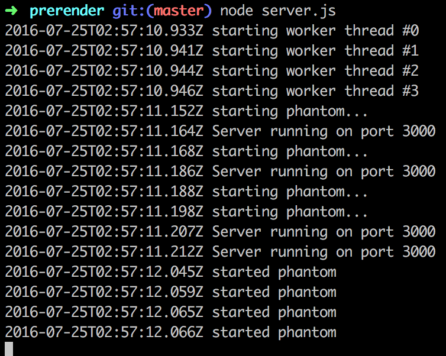
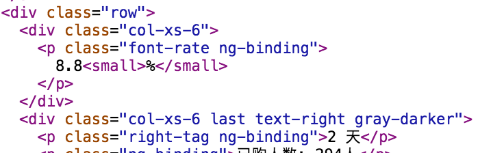

Nowadays people are always talking about the [MVVM](https://en.wikipedia.org/wiki/Model%E2%80%93view%E2%80%93viewmodel)/MVC patterns in front-end development, frameworks with these patterns include [AngularJS](https://angularjs.org/), [BackboneJS](http://backbonejs.org/), [KnockoutJS](http://knockoutjs.com/), [VueJS](https://vuejs.org/), etc..., which really make our coding life much easier, and even when we are dealing with large SPA projects, we have everything controlled in handy. But one common issue with these applications is that most of the data are rendered on client-side, which requires javascript to be executed, which then makes it harder for search engines to crawl and index your website cause usually the search engine won't execute your js code. 
We have couple of ways to solve this problem:   

* In Angular2 and ReactJS, we can pre render them on server side.
* Distinguish pages between normal users and crawlers, follow some SPA SEO guides like Goolgebot.  
* Ultimately pre render your AngularJS(or other frameworks) app with [prerender](https://prerender.io/), no matter whether it's different pages or SPA.

Here we will talk about the last solution which is much simpler and thorougher.

### How it works  

Behind prerender, it's a node server which fires up a browser environment with the help of [phantomjs](http://phantomjs.org/), which will run all your javascript code just as it is in your browser, and then prerender will generate the result into static html, and then you can serve these generated html files to search spiders.  

To have full control over the pre-rendering process, we should run the server locally and pre render the angularjs pages during our build process, although the prerender also provides a service that you can do this without setting up anything on your own environment.

### Pre render our angular pages

Now that we know how the prerender works, we can start to prerender our angularjs pages:P.

First of all, we may need to install prerender: 
```
//clone the code to your local
$ git clone https://github.com/prerender/prerender.git
$ cd prerender
//you may need to install nodejs first
$ npm install
$ node server.js
```
Now the prerender server is running on localhost:3000, which is ready for receiving dynamic pages for pre-rendering:



Then in your nodejs express app, add the `prerender-node` middleware to proxy your html to the above prerender server to start generating your static html:
`npm install prerender-node --save-dev`  
Add the [prerender-node](https://github.com/prerender/prerender-node) middleware:  
`app.use(require('prerender-node').set('prerenderServiceUrl', 'http://localhost:3000'));`  
Change the `prerenderServiceUrl` according to your own environment.  
Now if the requests are from a crawler or the query has `_escaped_fragment_`, the middleware will dispatch the request to prerender server and return the rendered static html to client.  

Image below is a snippet for the default html without prerender with all the angular tags inside:


And then the pre rendered html with angularjs code executed:
 


Compare with the two html snippets above, we can see that the 2rd snippet have all the angular tags rendered with related data, and now the search engine can see all the information of the html page, and can index your page more easily and accurately.

### Add pre-rendering into your build process

Above is just a simple demo to show you the idea of pre-rendering, but as a robust project, you should add this pre-rendering phase into your build process, e.g gulp, webpack, from which you can benefit much more.


### Conclustion

SPA or Ajax based application SEO is a hard work for both the developer and the SEO marketer, but with the help of prerender, we may have the best of the both worlds:).  