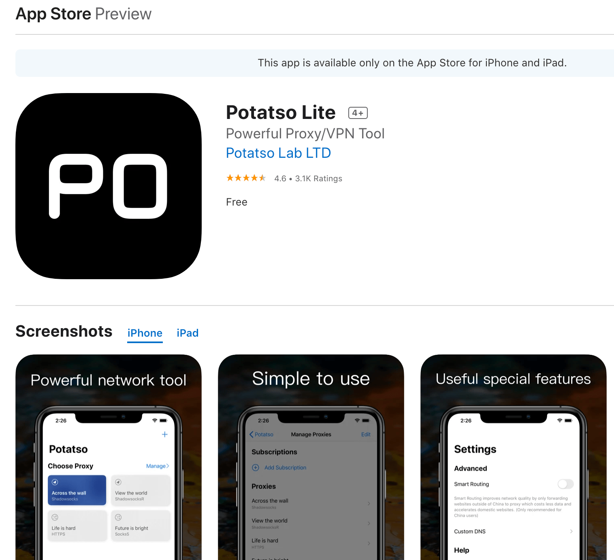
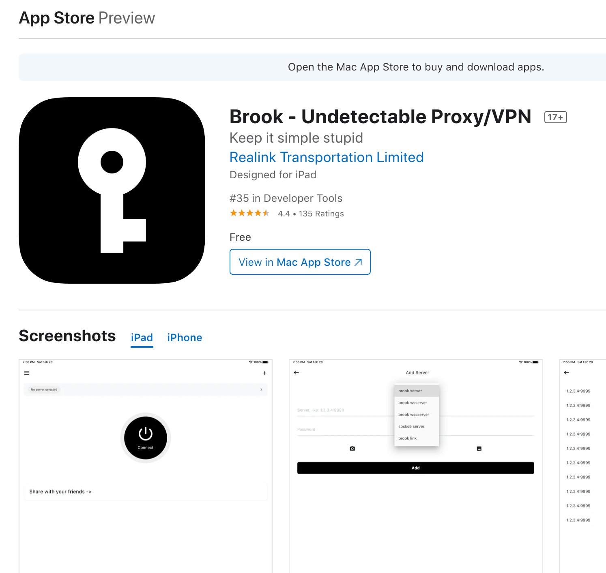
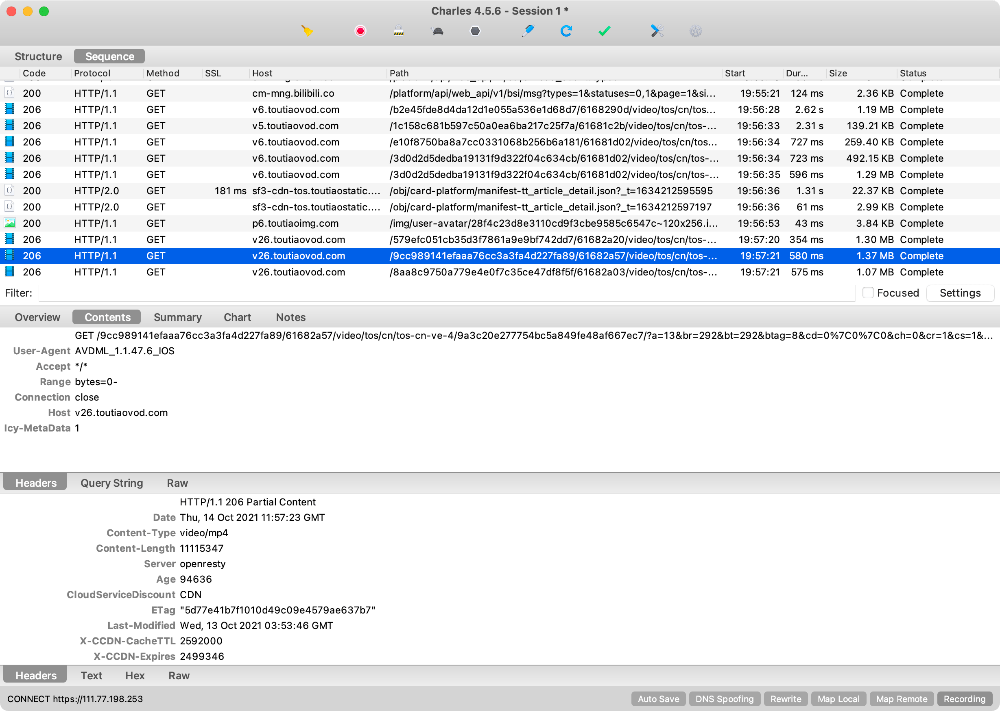

我们前端在做Web开发的时候，特别是手机端H5开发时，经常会用到Charles做抓包来进行一些debug，这对于常规的浏览器或者webview来说基本没啥问题，只要设置好Wifi的HTTP代理及相关证书，基本上前端页面的请求就可以抓到了，然而但是来了，对于想抓取某些App里面的某些请求你会发现死都抓不多，还以为是自己哪里配的有问题😂，这里举个🌰，我们可以尝试以常规的方式(HTTP代理)去抓取视频App里的视频相关的数据，你会发现Charles里基本只显示了一些文本API相关的请求，根本没有发现视频数据😭。

出现这种情况的基本原因是浏览器一般会默认遵循系统设置的HTTP/Socks代理, 但是其他App包括手机端和电脑端都是可以根据开发者喜好或者开发者用的网络库来决定，他们可能默认就不想让请求走系统的HTTP代理，所以我们经常会发现很多软件会有让你选择代理的功能，如下图就是Intellij系列设置IDE要不要走各种代理的配置：

对于很多命令行工具很多也默认不走HTTP代理，比如`curl`, 当然你可以通过`curl --proxy http://127.0.0.1:8888 url` 去手动让url的请求走代理；还有比如我们用Node.js写的一个脚本，然后脚本里发了一些请求，运行的时候这些请求也是不会走代理的，而是直连，除非你在node里手动设置了Agent去做代理，或者全局开启了VPN等之后才会走你设置的代理，那在移动端App里也类似，要么用第三方库，然后这些默认不走代理，所以你Charles里就显示不出来，还有一些可以检测到系统有没有设置了HTTP代理，然后它可以自己选择要不要走代理还是直连。

那对于这些不走代理，我们又想抓取这些app发出的请求怎么办呢，可能大家第一时间想到的是类似于`Wireshark`这种软件，他直接可以抓取Wifi层面或者说网卡层面的所有数据，但这玩意感觉实在是难用（学业不佳😭），太偏向底层太Hardcore了，都是在TCP层面，很难找到我们想要的HTTP层的数据，我们的目的还是想要通过Charles来抓到这些默认拿不到的数据。

这里我们解决的基本思路是让App检测不到我们加了代理，我们以iOS为例，要实现这种方式基本唯一的路子就是通过开启VPN来解决，也就是在iOS本地开启VPN, 然后让流量全部经过VPN，VPN正常APP是检测不到的，它以为就是直连（不做app开发，不确定是不是与开启vpn的方式有关, app store有一些直接手机端的抓包工具app，但是很多其实还是抓不到我们上面所说的视频数据的请求）。那怎么做呢，本人也不做原生app开发，自己肯定搞不了，所以唯一的出路就是找现成的app， 实现这样的VPN功能。

在谷歌上搜了一圈，发现在app store里还真有这种牛逼的app，以下就是找到的2个可以实现我们想要功能的app, `Potatso Lite`, `Brook`:

上面2个都可以实现我们想要的功能，用下来似乎[Potatso Lite](https://apps.apple.com/us/app/potatso-lite/id1239860606)(没设置科学上网可能直接页面404)用起来方便点，所以我们下面用Potatso Lite实现我们想要的抓包能力，我们的流程就是：

`app里网络请求` --> `流量经过Potatso Lite开启的VPN` --> `流量再转发经过Potatso Lite里配置的外部HTTP/SOCKS代理（charles）` --> `Charles里抓到包`

如上图可以在app里配置外部代理的地址，我们圈出来的就是自己Mac的charles的socks代理的地址，这里可以随便配置多个代理来做切换，协议也可以是http, socks, 甚至 shadowsocks都可以自己选择。配完后点击右下角开启按钮，开启VPN, 看看Charles里到底能不能抓到包🤓。

我们打开主流视频app头条，还有抖音看看抓包情况：

可以看到上图媒体数据的请求出现了🎉，基本都是206状态码的请求，因为很多单个请求都是请求视频的部分内容的。

> TIP: 从上面抓包的实践也可以发现一般app的开屏广告那个视频是可以通过WiFi的http代理直接抓到，而不需要经过VPN的处理。

## 总结

以上就是我们通过附加一层`App + VPN + 外部Proxy`实现了我们平时通过Wifi的HTTP代理抓不到的包，希望本文对前端同学、移动端同学平时的开发及debug过程有所帮助🥳🥳🥳。
