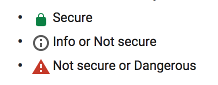
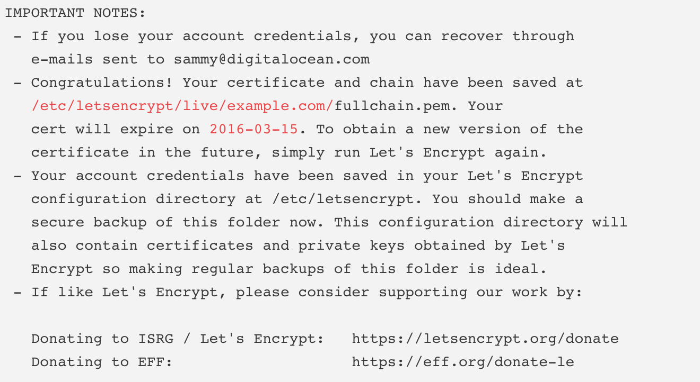
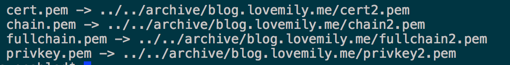
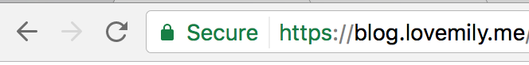
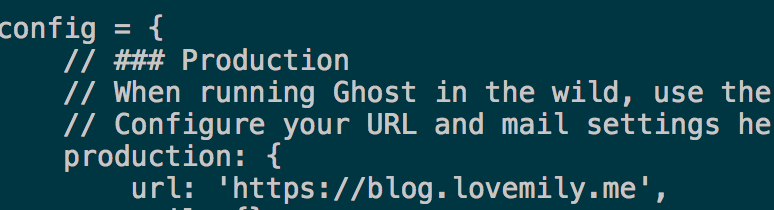

The Security and Integrity of modern web apps has become more and more important, a website without secure connection between the user and the server will leak user sensitive information, display inconsistent page content(e.g invasive ads), etc, which causes your website less trustable and worse UX to your users. Also from Chrome 56, if your website is not on https connection, it will display very attractive Not Secure warning to your users: 


 
So the first step, also the most important step is to enable https on your server, and luckily we can solve this issue by using the free [Let's Encrypt](https://github.com/letsencrypt) certificate to auto-enable https on your server. Let's Encrypt certificate is trusted by all modern browsers, so you can use it without worries.

Here I will show you how to enable https on a nodejs webapp(a Ghost blog here) behind the nginx on Ubuntu 16.4, actually we will config nginx mostly to serve the https content for the nodejs app.

### Prerequisites

Before we can use https, we need to do some preparation, first of all you may need to install nginx on your system, and nodejs/ghost(for the example in this article). Also you need to have access to your domain management, you should create an `A Record` that points to the public IP address of your server, Let's Encrypt will send validation to the server on which the certificate will issue. For example, if you want to issue cert on `www.yourdomain.com`, you could add your server IP to an `A Record` for this domain.
After everything is ready, we can start the process to obtain the certificate.

### Install certbot-auto

The easiest way to obtain the Let's Encrypt certificate is to install the Let's Encrypt client [certbot-auto](https://github.com/certbot/certbot):
```
$ cd /usr/local/sbin
$ sudo wget https://dl.eff.org/certbot-auto
```
Now you should have `certbot-auto` on `/usr/local/sbin`, before you can use that, you need to make it executable:
```
$ sudo chmod a+x /usr/local/sbin/certbot-auto
```
Now you are ready to obtain a certificate.

### Obtain a Certificate

The easiest way to pass the validation from Let's Encrypt is to configure your nginx to use Webroot Plugin, which will place a special file in `/.well-known` in your document root dir, which will be requested by the `certbot-auto`.
First of all, install nginx:
```
$ sudo apt-get update
$ sudo apt-get install nginx
```

And create a new site config file in `/etc/nginx/sites-available` to enable `/.well-known` access, we call it `ghost` since it's for ghost node app config: 
```
server {
        listen 80;
        server_name www.yourdomain.com;
        # the nginx root doc path could be different depends on your system
        root /var/www/html;
        location ~ /.well-known {
                allow all;
        }
}
```
and in the `/etc/nginx/sites-enabled`, create a link to the file above to enable it on nginx server:
`ln -s ghost /etc/nginx/sites-available/ghost`,  
Of course you can just config everything in `/etc/nginx/nginx.conf` directly, but for better organization, we should put site specific config in a separate file.  
You can type  
`$ sudo nginx -t`  
to check if your config file is valid before restart nginx service, if everything is ok, you can now restart the nginx server:  
`$ sudo systemctl reload nginx`

Now with nginx configured, we can use `certbot-auto` to finally obtain a certificate:
```
$ cd /usr/local/sbin
$ certbot-auto certonly -a webroot --webroot-path=/var/www/html -d www.yourdomain.com
```
Enter your email and agree the Terms at the prompt.  
If everything is ok, you can see the IMPORTANT NOTES on the output like this: 



The most important info inside is the location of your certificate and chain files, and the expiration date of your certificate.

There are couple pem files generated inside `/etc/letsencrypt/live/www.yourdomain.com`, list them by typing:   
`$ sudo ls -l /etc/letsencrypt/live/your_domain_name`,  e.g:   
`$ sudo ls -l /etc/letsencrypt/live/blog.lovemily.me` which will display like this:



### Config TLS/SSL on nginx

After you got the SSL certificate, you can finally configure that to nginx, the full configuration in `ghost` config file will be: 
```
server {
        listen 80;
        listen 443 ssl;
        server_name www.yourdomain.com;
        ssl_certificate /etc/letsencrypt/live/www.yourdomain.com/fullchain.pem;
        ssl_certificate_key /etc/letsencrypt/live/www.yourdomain.com/privkey.pem;

        root /var/www/html;
        location ~ /.well-known {
                allow all;
        }

        location / {
                proxy_set_header X-Real-IP $remote_addr;
                proxy_set_header X-Forwarded-For $proxy_add_x_forwarded_for;
                proxy_set_header X-Forwarded-Proto $scheme;
                proxy_set_header   Host      $http_host;
                # this is the ghost blog app address
                proxy_pass         http://127.0.0.1:2368;
        }
}
```
And check the config file and restart nginx:
`$ sudo nginx -t`  
`$ sudo systemctl reload nginx`  

Now go to `https://www.yourdomain.com` to see if https is enabled successfully like below:  


If you want to enable https on full ghost website, aka: redirect all `http` requests to `https`, you can configure the `ghost` file, and a easier way to do that is to edit the `config.js` file in ghost project source dir:


Change the `url` property to `https://www.yourdomain.com`.

### Auto Renewal your Certificate

Let’s Encrypt certificates are only valid for 90 days, also the certbot-auto won't auto renew your certficate automatically, so what you can do is to set up a schedule script to renew your certificate like every week to prevent expiration.  
To renew your certificate manually:
`$ certbot-auto renew`  

But we can use `crontab` set up a schedule to run the renew process and restart nginx automatically:
`$ sudo crontab -e` and type like this:  
```
30 2 * * 1 /usr/local/sbin/certbot-auto renew >> /var/log/le-renew.log
35 2 * * 1 sudo systemctl reload nginx
```
The job above means that the `certbot-auto renew` will be executed every Monday at 2:30AM, and reload nginx at 2:35AM. Now you don't need to worry about renew your cert manually, which is really a life saver :).

### Conclusion

Improve your website security with HTTPS is now much more important than before, Let's Encrypt provides us an easy way to enable https on our own server for free, you should really try this out by yourself to make your website more attractive to your users.

### References

- [How-to-secure-nginx-with-let-s-encrypt-on-ubuntu](https://www.digitalocean.com/community/tutorials/how-to-secure-nginx-with-let-s-encrypt-on-ubuntu-14-04)  
- [Install-and-configure-nginx-on-ubuntu](https://www.digitalocean.com/community/tutorials/how-to-install-nginx-on-ubuntu-16-04)  
- [Ghost blog platform](https://ghost.org/)


