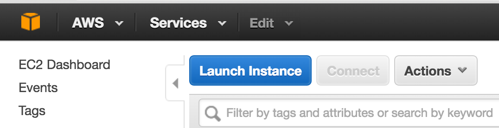
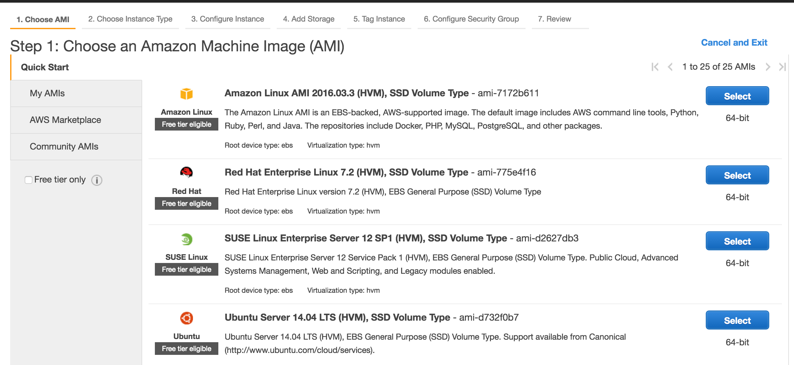
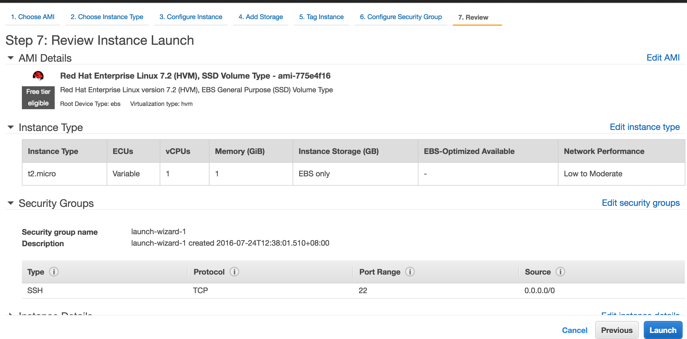
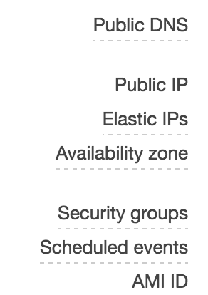
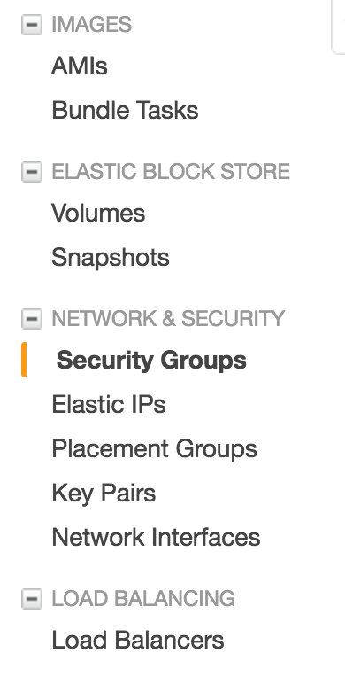
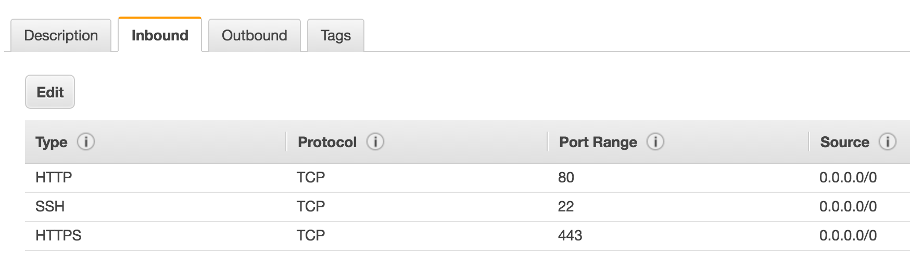

After your development with your application, you need to deploy it to a server so that people can use it all around the world. By doing that, we need to choose a proper server provider, on which your app should be running.
In China, usually we will use Aliyun to deploy our app, but one restriction with Aliyun is that your domain need to be recorded before passing through the Aliyun service, so the result is that we will use [AWS](https://aws.amazon.com/)(Amazon Web Services) to deploy our app, which is much better than Aliyun, also it has a [Free Tier](https://aws.amazon.com/free/) service that we can get started easily.

### Get and Launch your EC2 Container

First of all, go to the AWS website to register your account, and get your free tier, then go to the AWS console to start  your configuration.

1. In console, start `Launch Instance` to configure your server:

  
2. There are couple of steps to configure your os before running the instance:

  
3. Review the configuration and launch the instance:

  
4. After launching your instance, click the `1 running instance` to check the running instance status, you can see the info of the current instance, including instance id, state, public ip, private ip, etc...

### Deploy NodeJS app on your EC2 container

After your instance is launched, your can connect to your  instance remotely and do your deployment.  
1. Use <a href="http://docs.aws.amazon.com/AWSEC2/latest/UserGuide/AccessingInstancesLinux.html" target="_blank">this guide</a> to connect to your instance with ssh,  
Install the necessary components(<a href="https://blog.lovemily.me/using-nvm-to-manage-node-versions/"  target="_blank">nodejs by nvm</a>, git...),
clone your code here, and start your deployment process.  
2. When your app is running locally, you need to make your app accessible on the internet so that people can use your service.  
The default Network Interfaces configuration is that you can only access the instance with ssh, but you can edit or add your own rules in the console.  
In your console, go to the `NETWORK & SECURITY` / `Security Groups`, click on your instance, and choose the `Inbound` tab to view the current rules, here you can add others rules like http/https which is necessary if your app is served with http protocal.

    
3. Map your domain to your instance's IP  
As for now, you can access your service with ip directly, but the further solution is using your own domain so that people can remember your address easily.  
Go to your console's `INSTANCES / Instances`, click your instance item, below which, your can see the status and information of the selected instance, in the `Description` tab, get the `Public IP` and set the ip in your domain configuration, now your own domain is mapped to your instance ip, and other people can finally access your service :).

*TIP: One important thing is that don't forget to add your http/https rules, otherwise people cannot access your service even if your app is running properly on your local instance.*

After all the steps above are done, your service is finally available on the internet with your own domain:).  
You are now also not restricted by the complex domain recording process in Aliyun. 
Cheers :)...
