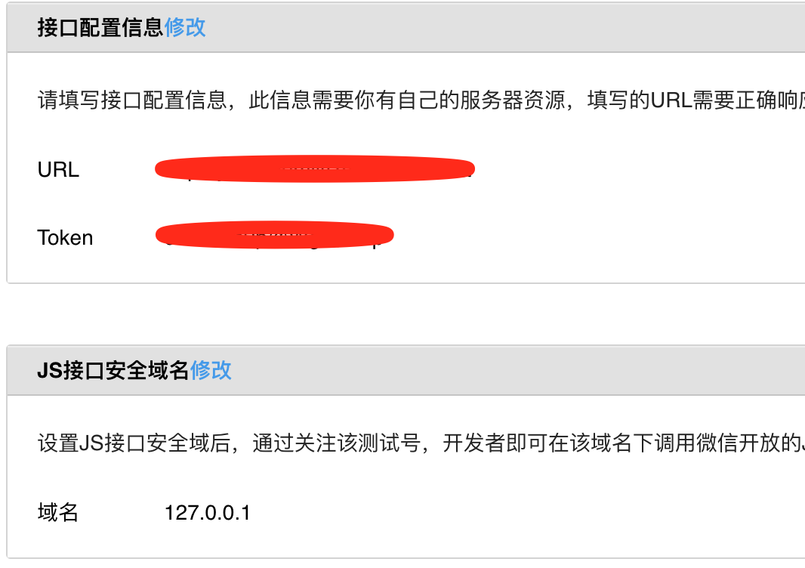
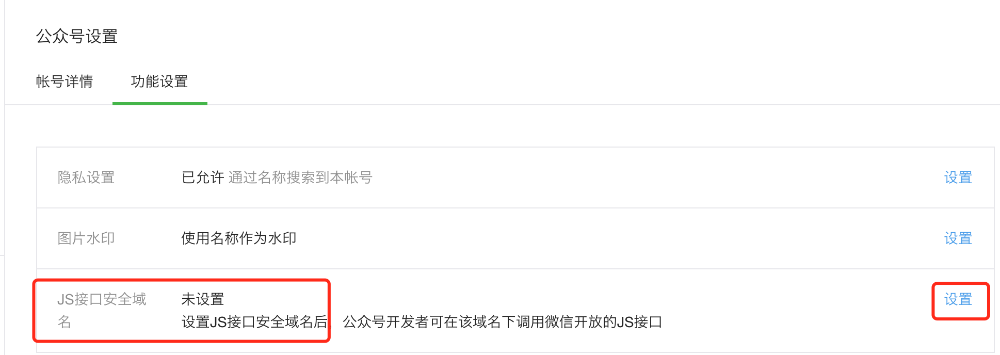
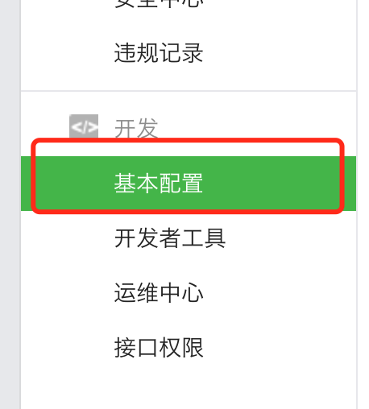
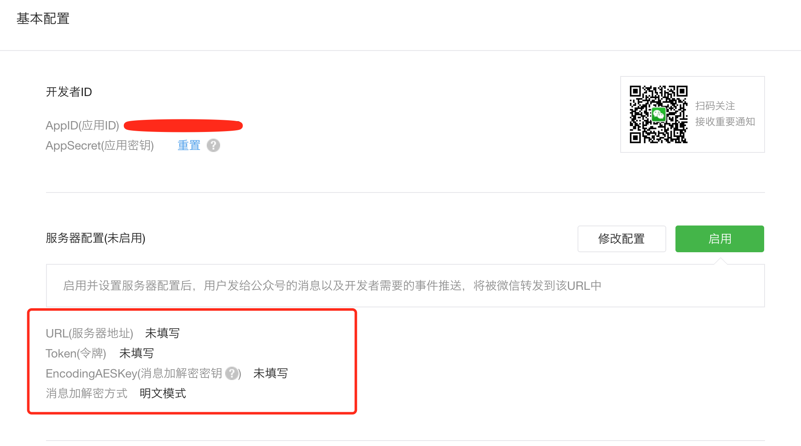

[Wechat](https://web.wechat.com/) has been one of the most famous instant message apps in the world, but also a major zone for business for companies and organizations especially in China. Almost every company in China has a business or public/subscribe account on Wechat platform, which makes it much more important for web developers to make the best use of wechat and it's APIs. Here I want to talk about by using the next-gen [wechat-jssdk](https://github.com/JasonBoy/wechat-jssdk) lib to leverage the [Wechat JSSDK APIs](https://mp.weixin.qq.com/wiki/11/74ad127cc054f6b80759c40f77ec03db.html) for H5 or mobile pages that are used in wechat app with the ability to invoke wechat apis and even native apis exposed by wechat app.

[wechat-jssdk](https://github.com/JasonBoy/wechat-jssdk) is a next generation lib with NodeJS integration by using ES6 features. I will go through the features powered by this lib one by one to give you a better understanding for the apis, so that you can get start very quickly when you need to develop such features.

### Features
TL;DR

- [Setup](#setup-wechat-configuration)
- [Using JSSDK](#using-jssdk)
- [Using OAuth](#using-oauth)
- [Using Stores](#using-stores)

<h2 id="setup-wechat-configuration" href="setup-wechat-configuration">Setup Wechat Configuration</h2>

Before you can use the jssdk, first you need to setup some basic configuration on [Wechat Dashboard](https://mp.weixin.qq.com), login with your wechat account(usually you need a `public` or `subscribe` account, the personal account may not work).

If you want to test with your personal account, you can go to the `开发者工具` menu(see the menu image below), and click on the `公众平台测试帐号`(test account) to the test account configuration page to use your personal wechat account to test the functionality.

Test account configuration page:

The `JS接口安全域名` should be the same domain(here is the local ip, also should be on port 80) as your test page domain, to configure this in production/real account, go to `公众号设置`(account configuration) menu just above the major `开发` menu：


Now click on the `基本配置`(basic configuration) menu on the left-bottom of the left navigation.

And you will need to input the information on the `服务器配置`(server configuration) section(red square below):


- URL: URL is your route/address to handle all requests/validations from wechat server, e.g. "https://your.domain.com/api/wechat". When you click save, wechat server will send a validation request to this url, the example code below will handle this verification,
- Token: your custom wechat token, anything you want, but should be equal to the `wechatToken` in the config below when you initialize the `Wechat` instance,
- EncodingAESKey: this is needed if you want your communication between wechat server to be encrypted, but we will leave that empty for simplicity for now. 

You can simply call wechat-jssdk api to handle this in your route when you click save button: 

`npm install wechat-jssdk` first, and then  

```javascript
const Wechat = require('wechat-jssdk');
const wx = new Wechat({
  "wechatToken": "wechat_token", //same as "Token(令牌)" in the form above
  "appId": "appid",
  "appSecret": "app_secret",
});
  router.get('/api/wechat', function(req, res){
    if(wx.jssdk.verifySignature(req.query)) {
      res.send(req.query.echostr);
      return;
    }
    res.send("error");
  });
```
If it passes the `verifySignature` verification, your configuration will be saved successfully, and you can continue to next step.

<h2 id="using-jssdk" href="#using-jssdk">Using JSSDK</h2>

On the previous section, I've showed you how to simplely initialize your wechat object. After your wechat basic configuration has been saved, you can start to use wechat jssdk for your pages.

First of all, you may need to provide an api for your pages to get the signature for the current page url:
```javascript
//...ignore some code
const wx = new Wechat(config);
router.get('/get-signature', function(req, res){
  wx.jssdk.getSignature(req.query.url)
    .then((signatureData) => {
        res.json(signatureData);
      });  
});
```
`signatureData` result will contain:
```javascript
{
  nonceStr: 'aaa',
  timestamp: 'bbb',
  signature: 'ccc',
  url: 'url' //url used to gen signature, "hash" will be ignored
}
```

In your browser you may need to send an ajax request to "/get-signature" to get the signature with the current url passed to this api.  

#### In Browser

In your browser side js, you will require the client js:
> I assume you are in a module bundling env, if you don't have a module bundler, you need to just use the pre-built client js `./dist/client.min.js` in your `<script>` tag to your html directly.

```javascript
var WechatJSSDK = require('wechat-jssdk/lib/client');
var wechatObj = new WechatJSSDK(config)
// or in non-module bundler system, access that in window:
//var wechatObj = new window.WechatJSSDK(config)
```
where config will be like:
```javascript
var config = {
  //below are mandatory options to finish the wechat signature verification
  'appId': 'your_wechat_appid',
  //the 3 properties below should be received like api '/get-signature' above
  'nonceStr': 'xxx', 
  'signature': 'xxx',
  'timestamp': 'xxx',
  //below are optional
  //invoked if wechat signature sign succeeds,
  'success': function(){}, 
  //invoked if sign failed
  'error': function(err){}, 
  //enable debug mode
  'debug': true, 
  'jsApiList': ['scanQRCode'], //optional, pass all the jsapi you want, the default will be ['onMenuShareTimeline', 'onMenuShareAppMessage']
  'customUrl': '' //set custom weixin js script url, you don't need to add the js by yourself
}
```
after signature signed successfully, you can customize the share information now:
```javascript
//customize share-on-chat info
//sugar method for `wechatObj.callWechatApi('onMenuShareAppMessage', {...})`
wechatObj.shareOnChat({
  type: 'link',
  title: 'title',
  link: location.href,
  imgUrl: '/logo.png',
  desc: 'description',
  success: function (){},
  cancel: function (){}
});
//call scan qr-code api
wechatObj.callWechatApi('scanQRCode', {
  needResult: 0,
  scanType: ["qrCode","barCode"],
  success: function (res) {
    var result = res.resultStr;
  }
});
```
use `wechatObj.wx` to access the original wechat object.  
If you failed(just in case, internally it will refresh the signature based on the expiration time and the wechat server response, so usually you don't need to reverify that, but just in case) to sign the signature(maybe the signature or token is expired), you can resign it by calling `wechatObj.signSignature(newSignatureConfig)`, where `newSignatureConfig`, which should be received by calling `/get-signature` api above again by passing an extra `force` parameter, should only contains the new:
```javascript
{
  'nonceStr': 'new_nonceStr',
  'signature': 'new_signature',
  'timestamp': 'new_timestamp',
}
```
you could send another param to '/get-signature' api to tell server it should regenerate the signature instead of getting it from cache, and in your node server route, the handler could update to:
```javascript
router.get('/get-signature', function(req, res) {    
wx.jssdk.getSignature(req.query.url, 
  req.query.force)
   .then(function(signatureData) {
      res.json(signatureDate);
    });  
  });
```
here just pass one more parameter to `getSignature` function to force the new creation of the signature.  
You can call other original wechat apis by using:  
`wechatObj.callWechatApi(apiName, apiConfig)`,  
`apiName` and `apiConfig` are the same as in [official wechat jssdk api wiki](https://mp.weixin.qq.com/wiki/11/74ad127cc054f6b80759c40f77ec03db.html#.E9.99.84.E5.BD.952-.E6.89.80.E6.9C.89JS.E6.8E.A5.E5.8F.A3.E5.88.97.E8.A1.A8)

You can test this in [wechat web develop tool](https://mp.weixin.qq.com/wiki/10/e5f772f4521da17fa0d7304f68b97d7e.html)
This is the basic workflow of working with the wechat-jssdk to leverage the wechat apis in mobile pages.

<h2 id="using-oauth" href="#using-oauth">Using OAuth</h2>

Besides the jssdk feature, [wechat-jssdk](https://github.com/JasonBoy/wechat-jssdk) also supports wechat web OAuth to get wechat user profile. You can pass the `wechatRedirectUrl` config when you initialize the `Wechat` object to use as the default redirect url, you can access the default oauth url by `wx.oauth.snsUserInfoUrl` and `wx.oauth.snsUserBaseUrl` with different `scope` option set, also you can generate custom url on runtime by calling  
`wx.oauth.generateOAuthUrl(customUrl, scope, state)`  
see:   
```javascript
//...
const wx = new Wechat({
  appId: 'xxx',
  //...
  wechatRedirectUrl: 'http://yourdomain.com/wechat/oauth-callback'
});
//set these default urls to page for a link:
//e.g. <a href="{{ oauthUrl }}">go to wechat oauth page</a>
router.get('/demo', function(req, res){
  res.render('demo.html', {
    oauthUrl: wx.oauth.snsUserInfoUrl
  })
})
//or you can generate runtime urls
router.get('/custom-url', function(req, res){
  const customRedirectUrl = req.query.customUrl;
  const oauthUrl = wx.oauth.generateOAuthUrl(customRedirectUrl, 'snsapi_userinfo');
  res.redirect(oauthUrl);
})
```
And you should add a handler for the redirect url to get user profile after user click 'Agree' button on the wechat oauth page:
```javascript
//suppose we use "http://yourdomain.com/wechat/oauth-callback" as configured above
router.get('/wechat/oauth-callback', function(req, res){
  wx.oauth.getUserInfo(req.query.code, key)
    .then(function(userProfile) {
      console.log(userProfile);
      //set openid to session to use in the  following requests
      req.session.openid = userProfile.openid;
      res.render("oauth", {
        wechatInfo: JSON.stringify(userProfile)
      });
    });
})

```
the `key` parameter in `getUserInfo` is used as an unique key to store the oauth token, the default key is the `openid` in returned user profile if you didn't pass anything, if you only need openid, you can call `getUserBaseInfo` to get basic profile.  
See the [Demo](https://github.com/JasonBoy/wechat-jssdk/blob/master/demo/index.js) in the lib to see how to use cached oauth token without getting `code` from wechat server every time.

<h2 id="using-stores" href="#using-stores">Using Stores</h2>

One question you may ask is "where did you store all the tokens and js tickets?" since wechat will limit the access for these information. And the answer is using [Store](https://github.com/JasonBoy/wechat-jssdk/wiki/Store).  
For simplicity sake, Stores are just some persistent place to store your tokens, e.g. file, db..., the default store used internally is `FileStore` if you didn't pass any custom store.  
```javascript
//use MongoStore
const Wechat = require('wechat-jssdk');
const MongoStore = Wechat.MongoStore;
const wx = new Wechat({
  appId: 'app_id',
  //...
  store: new MongoStore({...}) //default host and db name: 127.0.0.1:27017/wechat
})
```
The built-in stores we have for now are `FileStore` and `MongoStore`, to see more details and how to use custom store or create your own store, go to [Store in details](https://github.com/JasonBoy/wechat-jssdk/wiki/Store)

### Conclusion

This is the basic usage of [wechat-jssdk](https://github.com/JasonBoy/wechat-jssdk) to help you get into the wechat h5 development quickly without messing up with the token, signature generation related stuff, but also with flexibility to use custom oauth urls, custom Stores, etc...  
Hope this makes your wechat development life easier :P

### References

- [wechat-jssdk Project WIKI](https://github.com/JasonBoy/wechat-jssdk/wiki)  
- [Official Wechat JSSDK WIKI(Chinese)](https://mp.weixin.qq.com/wiki/11/74ad127cc054f6b80759c40f77ec03db.html)  
- [Use wechat test account](http://mp.weixin.qq.com/debug/cgi-bin/sandboxinfo?action=showinfo&t=sandbox/index)  
- [Wechat web development tool](https://mp.weixin.qq.com/wiki/10/e5f772f4521da17fa0d7304f68b97d7e.html)
