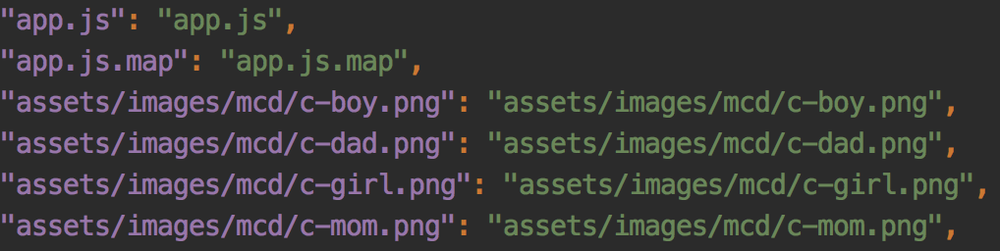

A mobile/h5 page has became a major promotion way for companies to do advertising for their users, especially to attract new potential users. Usually a promotion page contains lots of images, and other media assets, which are meant to be preloaded before the promotion contents display. Among these assets, the images are the most major contents of the whole page, while there is only one audio and video in the same page. So a major task is to preload all the images needed for the whole page, which will provide extremely better experience for your users.

Here I will talk about using pure javascript to preload all your images no matter where you use the image(js, html, css...) before your main content is displayed.
The first thing you need to do is to gather all the image urls needed for preloading. There are many tools to generate that, here if you are using [webpack](https://github.com/webpack/webpack) to bundle your assets, it's easy to get all the assets from a `manifest.json` file which is generated by webpack.

Filter all the images you need, and you are about to go.

It's easy to use js to load a single image using `Image` object:
```
const img = new Image();
img.src = '/image1.png';
```
You can also add event handler to check if the image is loaded successfully:
```
const img = new Image();
img.onload = function () {console.log('ok')};
img.onerror = function () {console.log('error')}
//make sure to add event handler before you add the src
img.src = '/image1.png';
```
After loading the image, you may probably need to add the element to DOM to ensure the cache:
```
const body = document.querySelector('body');
body.appendChild(img);
```
Even if you are using the image in your css file, the browser will still use the cached one without loading again for css style.
==**Make sure to add Cache-Control for your assets on production, especially on mobile device**==

> Using prefetch-image

It's annoying to load all the images manually while you have lots of them to preload, so I made a simple tool to help you prefetch your image assets easily using promise, you only need to provide all the image urls, and you are done, all the other work will be done automatically by [prefetch-image](https://github.com/JasonBoy/prefetch-image).
First install the module:
`npm install prefetch-image --save`  
or using yarn:
`yarn add prefetch-image`

And in your js:
```
//commonjs
const prefetchImages = require('prefetch-image');
//ES6
import prefetchImages from 'prefetch-image';
const images = [
  '/1.png',
  '/2.jpg',
  '/3.png',
];
prefetchImages(images, options)
  .then(() => {
    console.log('all images loaded!');
    //start init your page logic...
  }); 
```
And it's done, very easy and simple to use. For details, see [prefetch-image](https://github.com/JasonBoy/prefetch-image).

There are other alternatives to preload images, e.g use only css, or css and js together, but here I prefer use pure js which provides me the full control of all assets loading status.

Now your promotion page has a better user experience, cheers:)