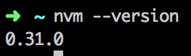
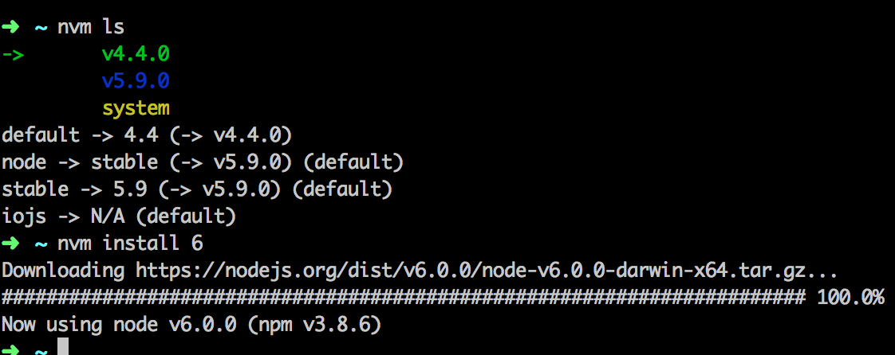

Usually we only have one machine, but we want to use different node to support different apps, like if we want to run **Ghost**, the recommended node version is __0.10.x__, but this version is really old, our new project may use 4.x or higher, but how do we have the best of the both world?

The answer is that we can use [nvm](https://github.com/creationix/nvm) to install multiple node versions for different projects.

Go to the [nvm github page](https://github.com/creationix/nvm) , use the script to install nvm:

```bash
curl -o- https://raw.githubusercontent.com/creationix/nvm/v0.33.11/install.sh | bash
```
  
or other alternative scripts.  
Then you can `nvm --version` to see the version:



And you are about to go: 
`nvm install 4` to install the latest node 4.x version,  
`nvm ls` to see all the node versions installed.



You can also install iojs if you want.

Sometimes you don't want to type the version everytime you use a different version, for this, you can set the alias for different node versions:  
`nvm alias default 4`  
`nvm alias newNode 6`,   
after that you can just  
`nvm use newNode` to switch among defferent versions.

You can also run node in different node version directly from the single line command: 
`nvm exec 6 node app.js` run app.js in version 6.x.

### How it works

After you install nvm, there will be a `.nvm` dir in your home dir, all the versions will be install inside this, which will be pointed to `node` according the version you are currently using:
```bash
which node
# ~/.nvm/versions/node/v4.4.0/bin/node
```  
the current node will be added to your `PATH` env before the default one `/usr/local/bin/node`:  
`echo ${PATH}`  
**_/Users/me/.nvm/versions/node/v4.4.0/bin:/usr/local/bin_**,   
and the node in nvm will have higher priority.

Now you can use any node version as you wish without deleting the old one and installing the new one, which is really a headache:(.

### Reference  

Another node version manager you can try: [n](https://github.com/tj/n)
